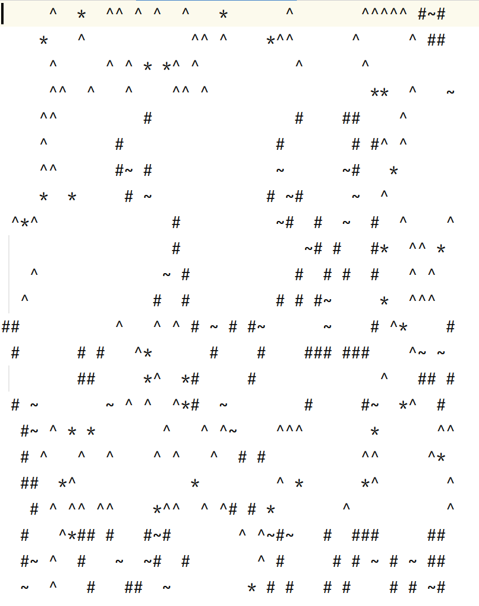

# mars-exploration-2

## About
Humanity wants to colonize the Mars. The goal of this project was to simulate a rover exploring a map, so I can determine whetever an area can be inhabited by a future human colony.
The rover scouts the map, collects information about the terrain and it's ressources and writes it's findings into a log file.

Java, Postgresql

## Get started

Clone the project load maven and run the application.

## Code Snippets
The MarsMap.txt file is a generated map, which the rover is exploring.


The doRead() method reads the file and returns a TwoDimensional Array of the map.
```js
  private char[][] doRead() throws IOException {
        List<String> allLines = Files.readAllLines(Paths.get(path));
        MapConverter mapConverter = new MapConverter();
        return mapConverter.convertFileToTwoDimensionalArray(allLines);
    } 
```

The ExplorationSimulator class takes care of the simulation.
In the scan() method the rover scans the environment and returns a ressource if found. The method checks also if the rover is still on the map.
```js
public Environment scan(Coordinate coordinate) {
        if (!roverIsOnMap(coordinate)) return null;
        int coordinateX = coordinate.x() + sight;
        int coordinateY = coordinate.y() + sight;
        String foundResource = String.valueOf(mapOfMars[coordinateX][coordinateY]);
        Symbol[] enumSymbol = Symbol.values();
        Symbol symbol = Arrays.stream(enumSymbol)
                .filter(symb -> foundResource.equals(symb.getSymbol()))
                .findFirst()
                .orElse(null);
        return symbol != null ? new Environment(symbol, coordinate) : null;
    }
```

The analyzeSuccess() method analyzes the ressources which the rover scans, and returns a Colonizable if living ressources where found. The rover also saves the coordinates where he found living ressources so that later a baseStation can be built.

```js
  @Override
    public Optional<Outcome> analyzeSuccess(Queue<Symbol> foundResources) {
        divideFoundResourcesIntoMineralsAndWater(foundResources, foundWaterList, foundMineralList);
        return checkIfColonizationIsPossible() ? Optional.of(Outcome.COLONIZABLE) : Optional.empty();
    }
```

The rover sends the data back to earth and it gets saved in a database. After that is also written as a .log file.

```js
 public void insertDataRowLog(int roverID, int step, String foundResource, Optional outcome) {
        String tableName = "marsexploration" + roverID;
        String insertQuery = "INSERT INTO "
                                    + tableName
                                    + " (roverid, step, foundresource, outcome)" +
                "             VALUES (?,?,?,?)";
        try (
                Connection connection = database.connectWithDatabase();
                PreparedStatement pst = connection.prepareStatement(insertQuery)
        ) {
            pst.setInt(1, roverID);
            pst.setInt(2, step);
            pst.setString(3, foundResource);
            pst.setString(4, outcome.toString());
            pst.executeUpdate();
        } catch (SQLException e) {
            e.printStackTrace();
        }
    }
```
